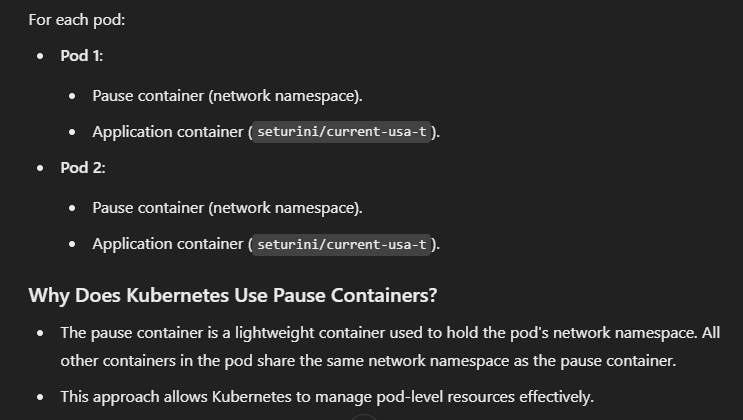
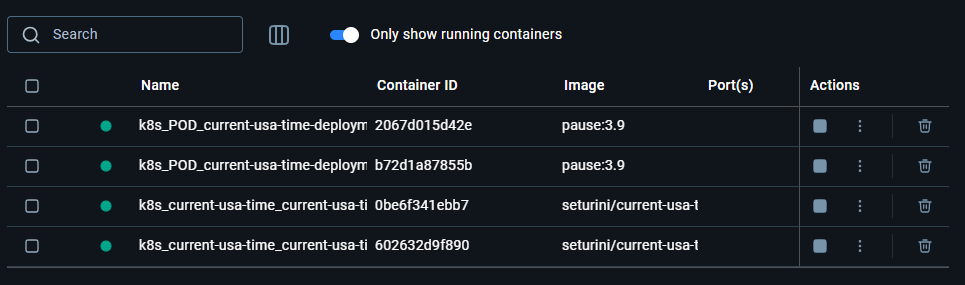

Docker Commands:
1. docker build -t current-usa-time .
2. docker run -p dockerPort:CodePort current-usa-time
3. docker pull seturini/current-usa-time
4. docker tag current-usa-time seturini/current-usa-time:latest
5. docker push seturini/current-usa-time:latest
6. docker ps (list down all active containers)
7. docker ps -a (list down all containers)
8. docker stop ContainerId
**Kubernetes:**
1. kubectl apply -f deployment.yaml   --> Create pods
2. kubectl apply -f service.yaml  --> A Service routes traffic to pods based on the labels defined in the Service's selector field.
   1 and 2 will start pods
3. kubectl get deployment
4. kubectl get service
5. kubectl get pods
6. to kill deployemnt: delete deployment current-usa-time-deployment ( will kill pods)
7. to kill service: kubectl delete service current-usa-time-service

   
   
